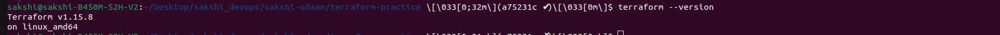
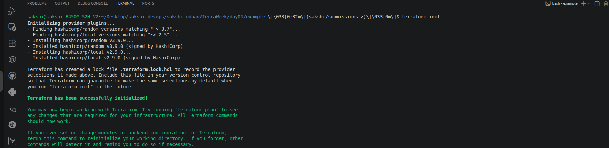
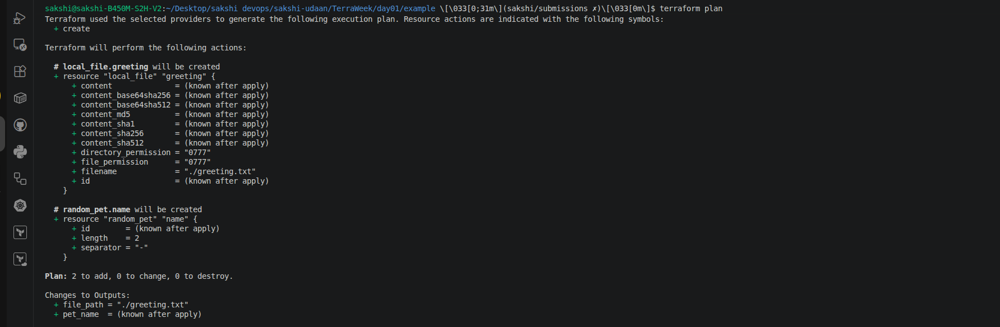
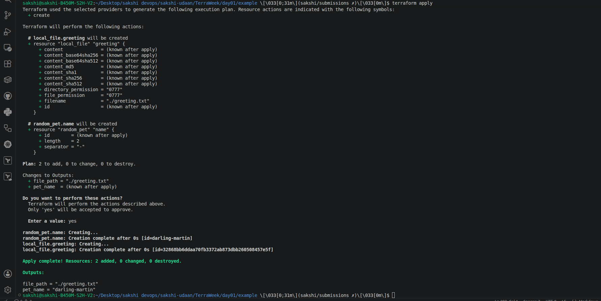
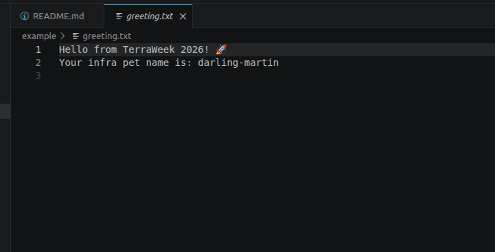
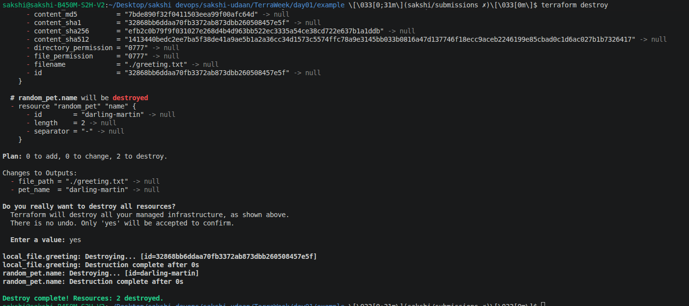

# 🌱 TerraWeek Day 01 – Introduction to IaC & Terraform Basics

> **Date:** 12 July 2026  
> **Challenge:** #TerraWeekChallenge  
> **Topic:** Introduction to Infrastructure as Code (IaC) & Terraform Fundamentals

---

# 📖 Overview

Day 01 was all about building a strong foundation in **Infrastructure as Code (IaC)** and understanding how **Terraform** helps automate infrastructure provisioning.

Instead of manually creating infrastructure through a cloud console, I learned how to define infrastructure using code and follow the core Terraform workflow to provision resources in a consistent and repeatable manner.

---

# 🎯 Learning Objectives

- Understand what **Infrastructure as Code (IaC)** is and why it matters.
- Learn what **Terraform** is and why it is widely adopted.
- Install and configure Terraform locally.
- Understand Terraform's core terminology and workflow.
- Provision my first resources using Terraform with zero cloud cost.

---

# 📝 Task 1: Understanding IaC & Terraform

## What is Infrastructure as Code (IaC)?

Infrastructure as Code (IaC) is the practice of managing and provisioning infrastructure through **code instead of manual configuration**.

### Problems Solved by IaC

✅ Eliminates repetitive manual tasks.

✅ Reduces human errors.

✅ Enables version control for infrastructure.

✅ Makes infrastructure reproducible and consistent.

✅ Speeds up environment provisioning.

✅ Supports automation and CI/CD practices.

---

## What is Terraform?

Terraform is an **open-source Infrastructure as Code tool developed by HashiCorp** that allows us to define, provision, and manage infrastructure using configuration files.

### Why is Terraform so Popular?

🌍 **Provider Agnostic** – Works with AWS, Azure, GCP, Kubernetes, Docker, and many more.

📝 **Declarative** – Define the desired state and Terraform figures out how to achieve it.

♻️ **Reusable** – Supports modules and reusable configurations.

🔄 **Version Controlled** – Infrastructure can be managed like application code.

🤝 **Large Ecosystem** – Thousands of providers and an active community.

---

## Terraform vs Alternatives

### Terraform vs OpenTofu
OpenTofu is the fully open-source fork of Terraform, while Terraform is developed and maintained by HashiCorp.

### Terraform vs Pulumi
Terraform uses HCL, whereas Pulumi allows infrastructure to be written using programming languages like Python, Go, and TypeScript.

### Terraform vs CloudFormation
Terraform supports multiple cloud providers, whereas CloudFormation is limited to AWS.

### Terraform vs Ansible
Terraform focuses on infrastructure provisioning, while Ansible focuses primarily on configuration management and application deployment.

---

# 📝 Task 2: Installing Terraform

Installed Terraform locally on Ubuntu using the official HashiCorp installation guide.

---

## Verify Installation

### Terraform Version

```bash
terraform version
```

📸 **Screenshot Placeholder**



---

### Terraform Help

```bash
terraform -help
```

---

## VS Code Extension Installed

✅ HashiCorp Terraform Extension

Features:

- Syntax highlighting
- Auto-completion
- Formatting support
- Better development experience

---

# 📝 Task 3: Learning 6 Crucial Terraform Terminologies

## 1. Provider

A plugin that enables Terraform to communicate with a platform or service.

Example:

```hcl
provider "aws" {
  region = "ap-south-1"
}
```

---

## 2. Resource

A piece of infrastructure that Terraform manages.

Example:

```hcl
resource "aws_s3_bucket" "demo" {
  bucket = "my-demo-bucket"
}
```

---

## 3. State

Terraform's record of the infrastructure it manages.

Stored in:

```text
terraform.tfstate
```

---

## 4. Plan

A preview of the changes Terraform will make.

Command:

```bash
terraform plan
```

---

## 5. HCL (HashiCorp Configuration Language)

The language used to write Terraform configurations.

Example:

```hcl
resource "random_pet" "name" {
  length = 2
}
```

---

## 6. Module

A reusable collection of Terraform configurations.

Example:

```hcl
module "networking" {
  source = "./modules/networking"
}
```

---

# 📝 Task 4: My First Terraform Configuration

For my first Terraform project, I used the **local** and **random** providers to create resources without requiring a cloud account or incurring any cost.

---

# 🔁 Core Terraform Workflow

```text
Write (.tf)
      ↓
terraform init
      ↓
terraform fmt
      ↓
terraform validate
      ↓
terraform plan
      ↓
terraform apply
      ↓
terraform destroy
```

---

## Initialize Terraform

```bash
terraform init
```

Downloads providers and initializes the working directory.

📸 **Screenshot Placeholder**



---

## Format Configuration Files

```bash
terraform fmt
```

Formats Terraform code according to standard conventions.

---

## Validate Configuration

```bash
terraform validate
```

Checks for syntax errors and configuration issues.

---

## Preview Infrastructure Changes

```bash
terraform plan
```

Shows the execution plan before creating resources.

📸 **Screenshot Placeholder**



---

## Create Infrastructure

```bash
terraform apply
```

Creates the resources defined in the configuration.

📸 **Screenshot Placeholder**



---

## Generated File

```bash
cat greeting.txt
```

Terraform generated a local file successfully.

📸 **Screenshot Placeholder**



---

## Clean Up Resources

```bash
terraform destroy
```

Removes all resources managed by Terraform.

📸 **Screenshot Placeholder**



---

# 🍫 Bonus Learnings

## Terraform CLI Autocomplete

```bash
terraform -install-autocomplete
```

Provides tab completion support for Terraform commands.

---

## Exploring OpenTofu

Learned that OpenTofu is the community-driven, fully open-source fork of Terraform.

---

## Understanding `.terraform.lock.hcl`

This file locks provider versions and checksums to ensure:

✅ Consistent environments

✅ Reproducible builds

✅ Stable CI/CD pipelines

---

# 🎯 Key Takeaways

- Learned the fundamentals of Infrastructure as Code.
- Understood why Terraform is one of the most popular IaC tools.
- Installed and configured Terraform locally.
- Learned the core Terraform workflow.
- Explored important Terraform terminologies.
- Created and destroyed my first infrastructure using Terraform.
- Understood the purpose of provider lock files and version management.

---

# 🚀 Conclusion

Day 01 laid the foundation for my Terraform journey. Understanding IaC and Terraform basics is the first step toward building scalable, automated, and reproducible infrastructure.

> **"If infrastructure can be written as code, it can be automated, versioned, and reliably reproduced anywhere."**

---

## 🙏 Acknowledgements

A huge thank you to **TrainWithShubham** and **Shubham Londhe** for organizing the **#TerraWeekChallenge** and making Terraform concepts easy to understand.

---

#Terraform #IaC #TerraformChallenge #TerraWeekChallenge #AWS #DevOps #CloudComputing #InfrastructureAsCode #TrainWithShubham